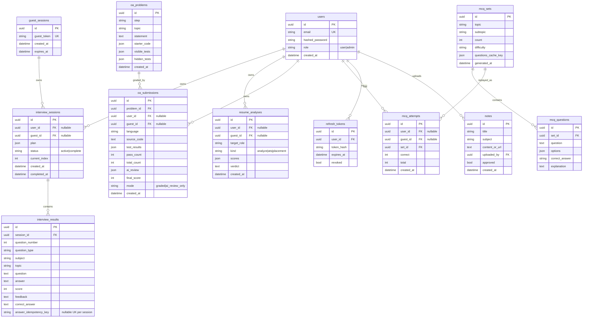
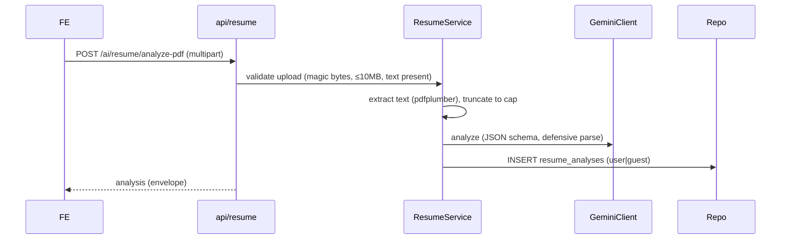
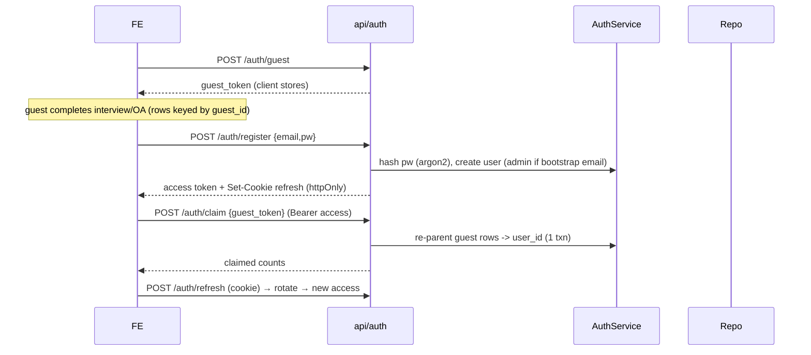

# PrepStack — Engineering Blueprint (Phase 0)

> Mandatory artifact per MASTER_PROMPT §12.1. **No application code may be
> written until this Blueprint and the Phase‑1 Roadmap (`docs/ROADMAP.md`) are
> presented and approved.** This document is the binding design contract; the
> Roadmap decomposes it into MECE atomic tasks.

**Status:** Draft for approval · **Date:** 2026‑07‑23 · **Author:** AI engineer (sole)

---

## 0. Ground Truth (what exists today)

| Asset | Stack | State | Keep / Change |
|---|---|---|---|
| `interview-prep-frontend` | React 18, Vite 5, Tailwind 3, JSX, react-router v6 | Working UI; all calls via `src/api/client.js` + `endpoints.js`; `lib/progress.js` = localStorage seam | **Keep design system**; extend `endpoints.js`; add auth/OA/history/notes; migrate `progress.js` to API |
| Service A `ai_serivce` | FastAPI, **legacy `google-generativeai`**, `gemini-1.5-flash` hardcoded | `SESSIONS` in-memory dict; `question_bank.py` (syllabus + Striver A2Z); `/code-review` (no execution) | **Migrate SDK/model**; replace `SESSIONS` with DB; reuse `question_bank`; add real OA compiler |
| Service B `resume_analyzer` | FastAPI, **modern `google-genai`**, `GEMINI_MODEL` env, async, JSON mime + defensive parse | Reference pattern for all Gemini calls | **Port everything onto this pattern**; fix `allow_origins=["*"]` |

**Critical finding (must fix before any commit):** `ai_serivce/.env` and
`.env.example` contain a **live-format Gemini API key in plaintext**
(`AQ.…`). It must be **rotated/revoked** and only ever supplied via
environment variables. No secret from the source archives will be copied into
the rebuilt repository. `.env` files are `.gitignore`d; only `.env.example`
with **placeholder** values is committed.

---

## 1. Architecture / Topology Decision (§5.1)

### Trade-off table

| Criterion | (a) 2 services + gateway | **(b) Modular monolith** ✅ | (c) Split AI-bound vs DB/CPU-bound |
|---|---|---|---|
| Render free services used | 3 (2 web + gateway) | **1 web + 1 static** | 2 web + 1 static |
| Cold-start economics (free tier spins down @15 min idle) | 3 independent cold starts, cascading latency | **1 cold start** | 2 cold starts + cross-call on cold path |
| Gemini/execution client reuse | Duplicated per service or shared lib overhead | **Single shared module, imported once** | Duplicated across the two web services |
| Operational simplicity | 3 deploys, 3 env sets, 3 log streams | **1 deploy, 1 env group** | 2 deploys |
| 512 MB RAM ceiling | Split but 3× base FastAPI overhead | **1 process footprint** | 2× base overhead |
| Demonstrates layered architecture in interview | Distributed complexity not justified by scale | **Clean `api→services→repositories→models` seams; DIP enforced** | Artificial seam that doesn't map to a real bounded context |
| Transactional writes across contexts (OA submit) | Cross-service = distributed txn / saga (overkill) | **Single DB txn, trivial** | Cross-service coordination |

### Decision: **Modular monolith (option b)** — one FastAPI app, one Render Web Service + one Render Static Site.

**Rationale (interview-defensible):** microservices solve *team-scaling* and
*independent-deploy* problems this project does not have; they would add three
cold starts, three env surfaces, and a distributed-transaction problem for the
OA `/submit` write — all cost, no benefit, on a single-team free-tier showcase.
A modular monolith with hard internal seams (`api → services → repositories →
models`, routers forbidden from importing `google.genai`/execution SDKs)
demonstrates the *same* layered-architecture and dependency-inversion
competencies an interviewer probes for, while staying inside 512 MB and one
cold start. "Why a modular monolith over microservices here" is itself a
prepared answer (see `docs/INTERVIEW_PREP.md`).

### Internal layering (§5.2)

```
backend/app/
  api/v1/            # routers — HTTP only, no business logic, no SDK imports
    interview.py mcq.py resume.py oa.py auth.py admin_notes.py users.py health.py
  services/          # business logic, orchestration, prompt assembly
  repositories/      # one repository per aggregate; only place that touches the DB session
  models/            # SQLAlchemy ORM models
  schemas/           # Pydantic request/response contracts (Field(..., description=...))
  core/              # config, security, logging, rate-limit, exceptions, DI wiring, lifespan
  integrations/
    gemini/          # client, prompts/, adapters, error taxonomy  (§10)
    execution/       # CodeExecutionProvider ABC + Paiza/Piston/Judge0 strategies (§11)
  db/                # engine/session, base, Alembic env
  tests/
```

**Enforced dependency direction:** `api → services → {repositories, integrations}`;
`integrations`/`repositories → models/schemas/core`. A CI import-linter (or a
unit test asserting `google.genai` / `httpx` execution SDK is not imported
under `api/`) makes DIP a *checked* property, not a described one.

---

## 2. Architecture Decision Records (§12.1.2)

Each ADR is also written to `docs/ADRS/NNN-*.md`. Summarized here.

### ADR-001 — Topology: Modular monolith
Decided above. Alternatives (2‑services+gateway; split by concern) rejected for
cold-start/ops cost with no scaling benefit. Free-tier consequence: one cold
start (~30–60 s) after 15 min idle → frontend must show a "waking the server" state.

### ADR-002 — Persistence: Managed Postgres (durable), repo-swappable
**Decision:** **Neon** free-tier managed Postgres as the primary durable store,
addressed purely through `DATABASE_URL`; **Render free Postgres** documented as
the drop-in alternative (same driver, one env-var change).
- **Alternatives considered:** (1) **SQLite on local disk** — *disqualified*:
  Render free web dirs are ephemeral; data is lost on every 15‑min idle
  spin-down, redeploy, and restart, which violates the DoD "restart does not
  lose history" (§13). Used **only** for the ephemeral pytest DB and never for
  durable history. (2) **Render free Postgres** — durable across restart/redeploy/
  spin-down but the free instance **expires 30 days after creation** (+14‑day
  grace) → requires a renewal runbook. Kept as documented alternative.
- **Why Neon primary:** genuinely always-free tier (data persists across its
  autosuspend; no 30‑day hard expiry), serverless Postgres, works with the exact
  same `asyncpg`/SQLAlchemy/Alembic stack → the repository layer makes the swap a
  one-line `DATABASE_URL` change.
- **Free-tier consequence & re-verification:** third-party free-tier terms
  change and **must be re-verified at build time** (§7), not trusted from this
  doc. If Neon's terms don't hold at build time, fall back to Render Postgres +
  the renewal runbook below.
- **Renewal runbook (Render Postgres fallback):** before day 30, provision a new
  free instance → `pg_dump` old / `pg_restore` new → update `DATABASE_URL` env →
  redeploy. If skipped, the demo **documents periodic data resets** as accepted
  behavior. Stated explicitly, not implicit.

### ADR-003 — Guest mode: persisted-under-guest-token, upgradeable on signup
**Decision:** guest activity **is** persisted (so `/run`, `/submit`, interview,
MCQ all behave identically to a logged-in user) but keyed to an anonymous
`guest_id` (opaque token, client-held, 7‑day server TTL). On registration within
the session, the guest's just-completed attempts are **claimed** (rows
re-parented to the new `user_id`). Expired/unclaimed guest rows are purged by a
lightweight cleanup on access.
- Alternatives: (1) *No persistence for guests* — simpler, but breaks the
  §9.5 "guest → registered upgrade" UX and can't show a summary on reconnect.
  (2) *Force signup* — rejected; violates the "just click Start" zero-friction
  requirement (§8). Free-tier consequence: TTL purge keeps the free Postgres row
  count bounded.

### ADR-004 — Auth token storage: same-origin proxy + httpOnly refresh cookie + in-memory access token
**Decision:** Frontend Static Site uses a **Render rewrite** so `/api/*` is
proxied to the backend web service → the browser sees **one origin**
(`prepstack.onrender.com`). This matches the existing `client.js` same-origin
`/api` default exactly. Therefore:
- **Refresh token:** `httpOnly; Secure; SameSite=Lax` cookie, path-scoped to
  `/api/v1/auth`. Not readable by JS → XSS can't exfiltrate it.
- **Access token:** short-lived (15 min) JWT held **in memory** (React state),
  never in `localStorage`.
- **CSRF:** `SameSite=Lax` + a custom-header requirement (`X-Requested-With`/
  double-submit token) on state-changing routes.
- **Alternatives:** (1) *access+refresh in `localStorage`* — rejected: readable
  by any injected script (XSS blast radius = full account takeover). (2)
  *cross-site `SameSite=None; Secure` cookies* (two Render subdomains) —
  viable but requires explicit double-submit CSRF and is a weaker default;
  documented as the fallback if the static-site rewrite is unavailable.
- Free-tier consequence: the rewrite means no CORS credentials complexity and
  no third cookie domain; refresh survives cold start because it's a
  stateless-verified JWT with a DB-backed rotation record.

### ADR-005 — Code execution provider via Strategy pattern
**Decision:** a `CodeExecutionProvider` ABC with interchangeable strategies.
> ⚠️ **Amended by [ADR-020](ADRS/020-free-code-execution.md) (2026-08-02).** Judge0
> CE was the original default on its "free" RapidAPI tier; that tier is now metered
> per submission, and the public Piston API went whitelist-only on 2026-02-15. The
> **default is now `paiza`** — a free, keyless public runner. Judge0 and Piston stay
> implemented behind the same ABC as one-env-var swaps.
- Provider selected via `EXECUTION_PROVIDER` env; **terms re-verified at build
  time** against each provider's own docs.
- **Degraded mode:** if the provider is unreachable/over quota, OA falls back to
  **AI-review-only** with a labeled banner — never silently "passes" tests.
- Free-tier consequence: execution is delegated (never in-process — §11.5); our
  service is a thin validated, rate-limited proxy + grader.

### ADR-006 — Prompt templates as versioned pure functions
Prompts live in `integrations/gemini/prompts/*.py`, one pure function per use
case `(typed inputs) -> str`, independently unit-testable (assert required
fields interpolated, no leaked internal instructions). Rejected: inline
f-strings in routers (current Service A style) — unreviewable, untestable.

### ADR-007 — Sync vs async boundaries
All outbound I/O is **async**: Gemini via `client.aio…`, execution via `httpx.AsyncClient`,
DB via **SQLAlchemy 2.0 async + `asyncpg`**. No blocking call inside `async def`
(the exact bug fixed in Service B — never reintroduced). Alembic runs with a
**sync** engine (migrations are offline/CLI, not request-path). Rejected: sync
SQLAlchemy + threadpool — simpler but muddies the "no blocking in event loop"
story that is a core interview point here.

### ADR-008 — DI mechanism: FastAPI `Depends`
Providers, repositories, and the Gemini/execution clients are injected via
FastAPI `Depends` (thin `get_*` provider funcs), overridden in tests with
`app.dependency_overrides`. Rejected: manual constructor wiring — more
boilerplate and no test-override ergonomics. Each service is unit-testable with
Gemini + execution mocked.

### ADR-009 — Pagination: `limit`/`offset`
History endpoints use `limit`/`offset`. Rationale: history is small and
per-user, users want "page 2", and offset is trivial to implement and test.
Cursor pagination (rejected) earns its complexity only at large scale / infinite
scroll, which this doesn't have. Documented so the trade-off is explicit.

### ADR-010 — PII / data retention
Resumes + interview transcripts contain PII. **Policy:** retained indefinitely
**tied to the owning account**; guest PII purged at TTL (7 days). **Deletion
path:** authenticated `DELETE /api/v1/users/me` cascades (FK `ON DELETE CASCADE`
+ service-level cascade) to that user's resumes, analyses, interview/OA
sessions, results, submissions. Logs never store raw resume/answer text by
default (log lengths/hashes — §9.4).

### ADR-011 — OA editor: Monaco, code-split
`@monaco-editor/react`, **lazy-loaded / route-code-split** so it is *not* in the
main bundle (Monaco is heavy; a fat main chunk compounds cold-start latency).
Rejected: CodeMirror 6 (smaller) — Monaco's IDE fidelity is the higher-value
demo for an "OA" experience; the bundle cost is contained by lazy-loading.

### ADR-012 — Build: native buildpacks, not Docker
Render **native Python + Node buildpacks**. Rationale: faster builds (shared
free build-minute budget), smaller/managed images, lower cold-start than a
hand-rolled Dockerfile. Rejected: Dockerfile — only justified if we needed a
system dependency the buildpack lacks (we don't; `pdfplumber` is pure-pip).

### ADR-013 — CI gates (strictness stated)
- **Blocking:** Ruff (lint, default + `I`,`B`,`UP`), mypy (`--strict` on
  `services/`,`integrations/`,`schemas/`), ESLint (recommended + react-hooks),
  `tsc --checkJs` (JSDoc types on new frontend modules), backend+frontend tests,
  **gitleaks** secret scan, coverage **≥80 % on `services/`**.
- **Reported-only (non-blocking):** `pip-audit`, `npm audit` — advisory signal;
  transient upstream advisories shouldn't block unrelated PRs. Stated explicitly
  per §9.1.

### ADR-014 — Frontend typing: keep JS + JSDoc `checkJs`
Keep the existing `.jsx` (no TS migration churn to the working design system);
enforce types via ESLint + `tsc --checkJs` with JSDoc on **new** modules (api
layer, auth context, OA). Rejected: full TS migration — large, risky rewrite of
assets we were told to preserve.

### ADR-015 — E2E: minimal Playwright, off the per-PR path
Implement a minimal Playwright suite for the two highest-value journeys
(interview start→answer→summary; OA problem→run→submit) but run it **on-demand /
nightly**, not on every PR, to respect free CI-minute budget. Per-PR CI runs
Vitest + pytest (all external calls mocked). Decision + manual-verification
checklist documented.

---

## 3. Data Model / ER Diagram (§12.1.3)



**Transactional writes (§7):** `POST /ai/oa/submit` writes `oa_submissions` **and**
any denormalized history counters in **one DB transaction**; partial failure →
full rollback (no orphaned score). `POST /ai/interview/answer` writes the
`interview_results` row + advances `current_index` in one txn, guarded by
`answer_idempotency_key` (idempotent retry — §6). Account deletion cascades in
one txn.

---

## 4. API Surface (§12.1.4)

Base: `/api/v1`. Envelopes: success per-resource; errors
`{ "error": { "code, message, details } }` from an internal exception hierarchy.
Rate-limit classes: **AI** (Gemini-backed), **EXEC** (execution-backed, stricter),
**AUTH**, **STD**.

| Method | Path | Auth | RL class | Txn / Notes |
|---|---|---|---|---|
| GET | `/health` | none | STD | liveness |
| GET | `/health/detailed` | none | STD | DB + Gemini/exec reachability (§9.4) |
| POST | `/auth/register` | none | AUTH | creates user; admin if email == bootstrap |
| POST | `/auth/login` | none | AUTH | sets refresh cookie, returns access token |
| POST | `/auth/refresh` | cookie | AUTH | rotates refresh token (DB record) |
| POST | `/auth/logout` | cookie | AUTH | revokes refresh token |
| POST | `/auth/guest` | none | AUTH | issues `guest_token` |
| POST | `/auth/claim` | access | AUTH | re-parents guest rows → user (upgrade) |
| GET | `/users/me` | access | STD | profile |
| DELETE | `/users/me` | access | STD | **cascade delete** (PII, §7/§9.1) |
| POST | `/ai/interview/start` | opt | AI | creates `interview_sessions` (user or guest) |
| POST | `/ai/interview/answer` | opt | AI | **idempotent**; writes result + advances index in 1 txn |
| GET | `/ai/interview/session/{id}` | opt | STD | reconnect/refresh |
| GET | `/ai/interview/history` | access | STD | `limit`/`offset` |
| POST | `/ai/interview/code-review` | opt | AI | free-text review (kept) |
| POST | `/ai/mcq/generate` | opt | AI | **cache-first** on `(topic,subtopic,count,difficulty)` (§10.5) |
| POST | `/ai/mcq/daily-challenge` | opt | AI | cached per day/topic |
| POST | `/ai/mcq/attempt` | opt | STD | records score to history |
| GET | `/ai/mcq/history` | access | STD | `limit`/`offset` |
| POST | `/ai/resume/analyze` | opt | AI | |
| POST | `/ai/resume/ats-score` | opt | AI | |
| POST | `/ai/resume/improve-bullet` | opt | AI | |
| POST | `/ai/resume/placement-check` | opt | AI | |
| POST | `/ai/resume/pdf-to-json` | opt | AI | upload validation (magic bytes, ≤10 MB) |
| POST | `/ai/resume/analyze-pdf` | opt | AI | |
| GET | `/ai/resume/history` | access | STD | `limit`/`offset` |
| POST | `/ai/oa/problem` | opt | AI | generate+persist problem (hidden tests fixed) |
| POST | `/ai/oa/run` | opt | **EXEC** | visible tests only, no score |
| POST | `/ai/oa/submit` | opt | **EXEC** | all tests + AI review; **1 txn**; degraded mode |
| GET | `/ai/oa/submission/{id}` | opt/access | STD | history (auth for non-guest) |
| GET | `/admin/notes` | admin | STD | list incl. unapproved |
| POST | `/admin/notes` | admin | STD | upload note |
| PATCH | `/admin/notes/{id}` | admin | STD | approve/edit |
| GET | `/notes` | none | STD | public approved notes (backs `/notes` page) |

OpenAPI `/docs` + ReDoc `/redoc` remain; every schema field documented.

---

## 5. Sequence Diagrams (§12.1.5)

### Interview lifecycle
```mermaid
sequenceDiagram
    participant FE as Frontend
    participant API as api/interview
    participant SVC as InterviewService
    participant QB as question_bank
    participant G as GeminiClient
    participant R as Repo(Postgres)
    FE->>API: POST /ai/interview/start {}
    API->>SVC: start(user|guest, difficulty)
    SVC->>QB: build_question_plan()
    SVC->>G: generate_question(plan[0])  (async, JSON, retry/breaker)
    SVC->>R: INSERT interview_sessions (plan, idx=0)
    API-->>FE: session_id + first question
    loop each answer
        FE->>API: POST /ai/interview/answer {session_id, answer, idem_key}
        API->>SVC: answer()  (idempotent guard on idem_key)
        SVC->>G: evaluate(answer) -> {score,feedback,correct}
        SVC->>R: BEGIN; INSERT interview_results; UPDATE idx; COMMIT
        alt more questions
            SVC->>G: generate_question(plan[idx+1])
            API-->>FE: evaluation + next_question
        else finished
            API-->>FE: evaluation + summary
        end
    end
```

### OA lifecycle
```mermaid
sequenceDiagram
    participant FE
    participant API as api/oa
    participant SVC as OAService
    participant G as GeminiClient
    participant EX as ExecutionProvider(Judge0)
    participant R as Repo
    FE->>API: POST /ai/oa/problem {step/topic}
    API->>SVC: create_problem()
    SVC->>G: gen statement+starter+visible+hidden tests (JSON, validated)
    SVC->>R: INSERT oa_problems
    API-->>FE: problem (visible tests only)
    FE->>API: POST /ai/oa/run {problem_id, lang, code}
    API->>SVC: run(): validate size/lang
    SVC->>EX: execute(code, visible stdin) per case
    API-->>FE: per-case pass/fail (no score, no hidden)
    FE->>API: POST /ai/oa/submit {problem_id, lang, code}
    API->>SVC: submit()
    SVC->>EX: execute against ALL tests
    alt provider ok
        SVC->>G: qualitative review
        SVC->>R: BEGIN; INSERT oa_submissions(graded); COMMIT
        API-->>FE: {test_results, pass/total, ai_review, final_score}
    else provider unreachable
        SVC->>G: review only
        SVC->>R: INSERT oa_submissions(ai_review_only)
        API-->>FE: AI-review-only + degraded banner
    end
```

### Resume analysis lifecycle


### Auth (register / login / guest-upgrade)


---

## 6. Ambiguities Found + Resolutions (§12.1.6)

1. **Repo location.** Master prompt says build in `Prep_Stack_Project/`; that dir
   currently holds only the source ZIPs, and the active git repo is unrelated
   ("Fra Atlas"). **Resolution:** create a **fresh git repo** in
   `Prep_Stack_Project/` with top-level `backend/` + `frontend/` + `docs/` +
   `render.yaml` + `.github/` (plain-directory workspace, independent tooling —
   §7 monorepo note). Extract the three archives into that layout in Phase‑1 T1.
2. **Directory typo `ai_serivce`.** Renamed away entirely; its code folds into
   `backend/app/` — no path preserved.
3. **Live API key in `.env.example`.** Treated as compromised; **rotate**; commit
   only placeholder `.env.example`. (Flagged above.)
4. **Frontend language.** Prompt allows "TypeScript **or** JSDoc check." Chosen:
   keep JSX + JSDoc `checkJs` (ADR‑014) to avoid rewriting preserved assets.
5. **Guest behavior** (persist-vs-not, §8 gives both). Chosen: persist-under-
   guest-token + claim-on-signup (ADR‑003) to satisfy §9.5 upgrade UX.
6. **Token storage cross-origin reality.** Two Render subdomains would break
   `SameSite=Lax`. Chosen: static-site **rewrite proxy** → same origin →
   `Lax` httpOnly refresh + in-memory access (ADR‑004); cross-site `None;Secure`
   documented as fallback.
7. **Live deploy needs the user's accounts.** A live Render deploy, Neon/Render
   Postgres provisioning and a rotated `GEMINI_API_KEY` (code execution needs no
   key — ADR-020) **cannot be done without you**. Resolution: I build everything deploy-ready
   (committed `render.yaml`, `.env.example`, runbooks) and hand you an exact
   step list; the final "click deploy / paste keys" steps are yours. This is the
   one DoD item I cannot satisfy unilaterally.
8. **`response_schema` support.** Prefer `response_schema` (Pydantic→schema) over
   prompt-only JSON where the installed `google-genai` supports it; fall back to
   prompt-only + defensive parse per call, documented (§10.2).
9. **Idempotency for `/answer`.** Client sends an `idempotency_key` per answer;
   server dedupes per `(session_id, key)` so a timeout retry can't double-count
   (§6).
10. **Difficulty/count knobs** exist in current code; preserved as validated,
    capped inputs (guardrails §10.5).

---

## 7. Free-Tier Survival Notes (per binding decision, §3)

- **Cold start (15‑min idle spin-down):** one web service → one ~30–60 s cold
  start; frontend shows a "waking up the server" state driven by `/health`.
- **512 MB RAM:** single FastAPI process; no in-process code execution (delegated);
  Monaco lazy-loaded off the main bundle.
- **Ephemeral disk:** no durable data on local disk; Postgres (Neon/Render) for
  everything in the schema; SQLite only for the pytest DB.
- **Request timeout:** every Gemini/exec call has a timeout < Render's; retries
  bounded; circuit breaker prevents pile-ups.
- **In-memory rate limiter resets on restart:** accepted trade-off (documented);
  a Redis-backed limiter is the future upgrade.

---

## 8. Approval Gate

Per §12.3 / §13, **implementation does not begin until this Blueprint + the
Phase‑1 Roadmap are approved.** The Roadmap (`docs/ROADMAP.md`) is delivered
next; then, on your go-ahead, execution proceeds **one atomic task per turn** in
dependency order, each with its validation run and results reported.
